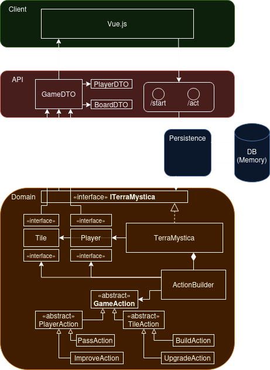

# Sogyo IP


## Doel
Het doel van dit project is om een opzet van [Terra Mystica](https://boardgamegeek.com/boardgame/120677/terra-mystica) te implementeren. In Terra Mystica strijden vijf spelers om hun factie succesvoller te ontwikkelen (meer VPs te verkrijgen) dan de anderen.

Elke factie is gebonden aan een bepaald landtype en kan alleen op dat specifieke terrein bouwen (bijv. elven leven alleen in bos, dwergen in berggebied, etc.). Tijdens het bouwen van nieuwe gebouwen kan het land wel omgevormd worden waar nodig, maar voor sommige landtypes is dit duurder dan voor andere. Bij het bouwen kan men alleen in tegels naast al bestaande gebouwen bouwen waarbij men wel een of meerdere riviertegels kan overslaan. De kosten van terraformen en de hoeveelheid rivier die een factie kan overslaan kan worden verbeterd tijdens het spel.

De VPs die iemand krijgt komen voornamelijk van bonustegels en ronde-specifieke scoretegels, die een bepaald aantal punten geven voor het bouwen van specifieke gebouwen of het doen van bepaalde acties. Ook krijgt men aan het einde van het spel punten het hebben van de meeste verbonden gebouwen.

## Installatie

Download en installeer alle benodigdheden als volgt (heeft `npm` nodig):
```
git clone https://github.com/danielpols/sogyo-ip.git
cd sogyo-ip/client
npm install
```

Start de Java back-end server vanuit de `sogyo-ip/` map:
```
./gradlew run
```
en de front-end server vanuit `sogyo-ip/client` met:
```
npm run dev
```

## MoSCoW
De doelen van dit project opgeschreven in MoSCoW-format:

- Must
  - [x] Een hexagonaal bord laten zien.
  - [x] Landtypes inlezen vanuit een database.
  - [x] Gebouwen op het bord kunnen bouwen.
  - [x] Landtype aanpassen tijdens het bouwen.
- Should
  - [x] Tonen op welke zeshoeken een speler mag bouwen.
  - [x] Laten zien hoe "moeilijk" het terraformen is.
  - [ ] Tonen welke speler het grootste aaneengesloten gebied bezit.
  - [x] Spelstatus kunnen coderen/decoderen vanuit een in-memory database (zonder het hele object op te slaan).
  - [x] Laten zien wat de kosten van een actie zijn.
- Could
  - [x] Resource income implementeren.
  - [ ] Detecteren waar een stad gemaakt word (genoeg gebouwen naast elkaar).
  - [ ] Connectie maken met een externe database.
  - [ ] Facties implementeren.
  - [ ] Bonuskaarten en scoretegels toevoegen
- Won't
  - [ ] Bruggen toevoegen
  - [ ] Power/elementenbord acties toevoegen.
  - [ ] Mooie visuals toevoegen


## Architectuur

Deze applicatie bestaat uit de volgende lagen:
- Client: Een Vue.js/Vite front-end server.
- API: Een Java/Jetty back-end server die aangeroepen wordt vanuit de client.
- Persistence: Een Java in-memory repository en database.
- Domain: De Java laag die de back-end logica doet.



De API heeft twee endpoints, `/start` en `/act`, voor het aanmaken en het spelen van een spel respectievelijk. Alle acties die gedaan moeten worden in het spel moeten via de persistencelaag lopen, want de API mag niet de staat van het spel zelf aanpassen. De informatie die terug wordt gestuurd naar de client heeft een vergelijkbare structuur als het spel-object in het domein.

## Persoonlijke leerdoelen

- Beter bekend raken met AGILE/SCRUM.
- Git georganiseerd houden en vaak committen.

## Technische leerdoelen

- Meer comfortabel worden met front-end development.

